# Quiz App for iOS

A feature-rich iOS Quiz App built with Swift, Xcode, and UIKit, offering a seamless user experience with multiple-choice and numerical questions, editable question management, custom drawing capabilities, and persistent data storage.

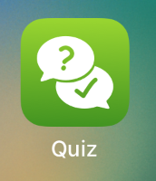

## Screenshots

| 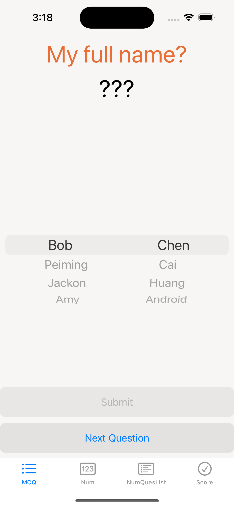 | 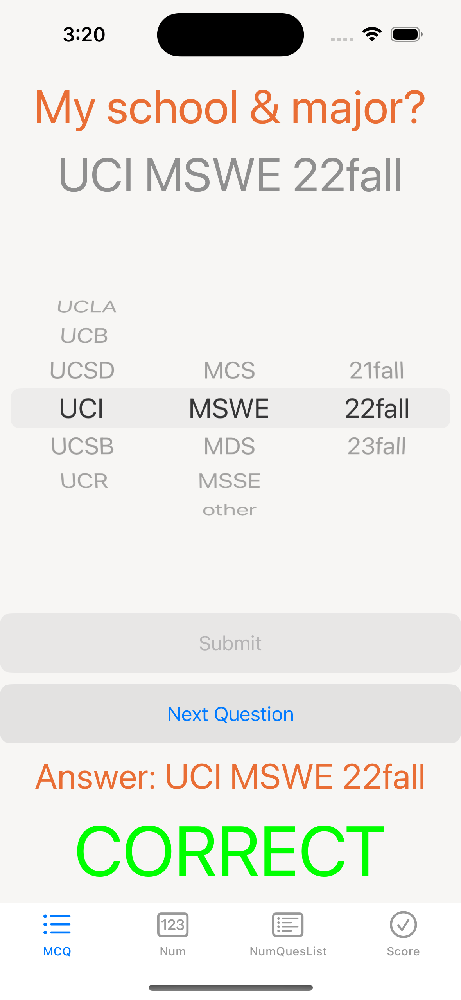 | 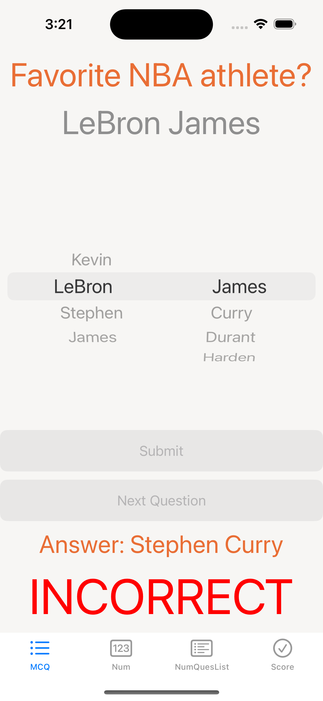 |
|:------------------------------------------:|:--------------------------------------------:|:----------------------------------------------:|
|       Multiple-choice Questions            |      Correct MCQ Answer Selected             |     Incorrect MCQ Answer Selected              |

| 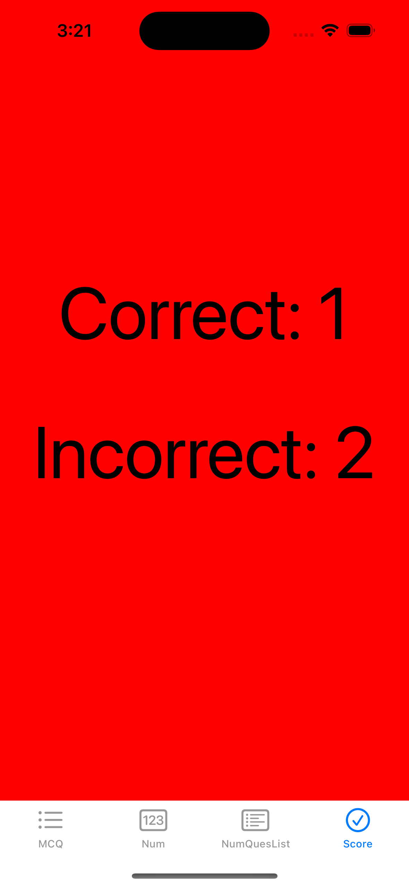 | 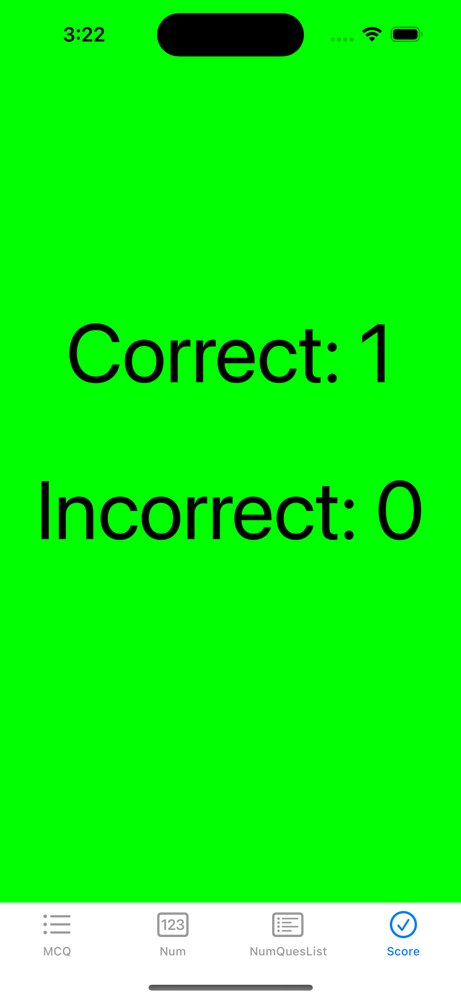 |
|:------------------------------------------------------:|:--------------------------------------------------:|
|        Score with Red Background (More Incorrect Answers)  |      Score with Green Background (More Correct Answers)  |

| 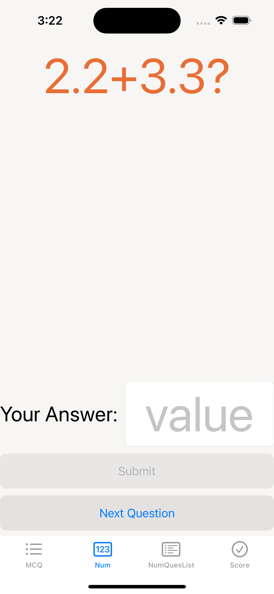 | 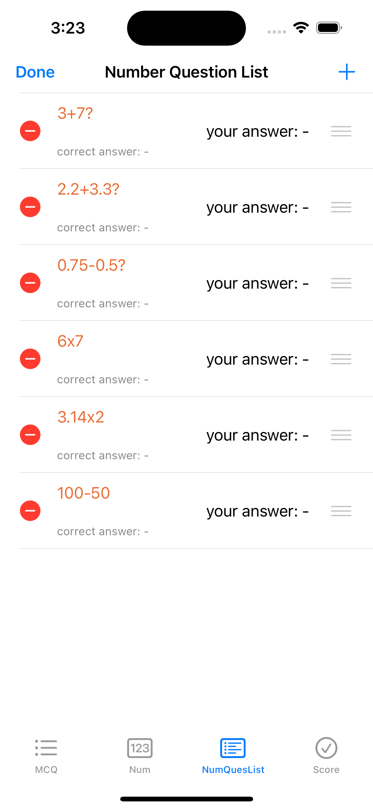 | 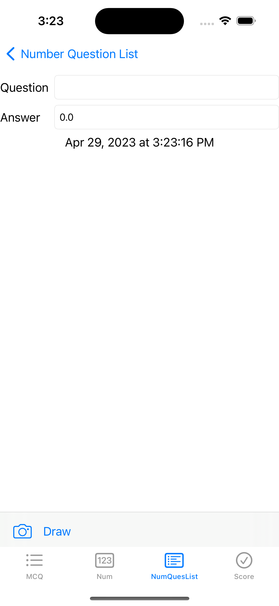 |
|:----------------------------------------------------:|:---------------------------------------------------:|:------------------------------------:|
|       Numerical Fill-in-the-blank Questions          |        List of Numerical Questions                  |      Detail View for Editing        |

| 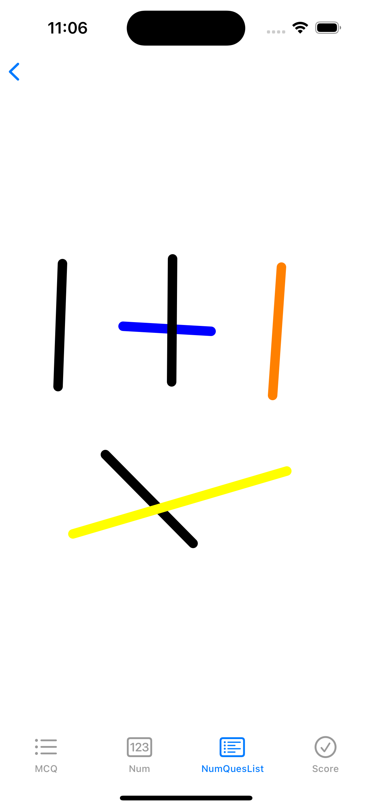 | 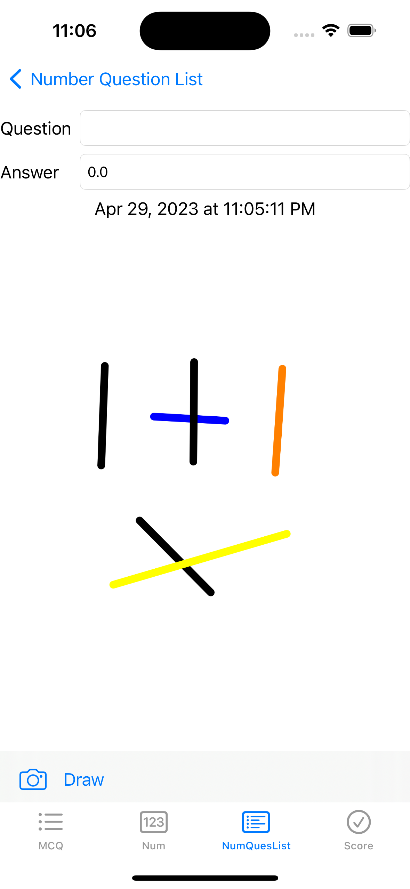 |
|:------------------------------------------:|:-------------------------------------------------------:|
|         Drawing Canvas                     |          Detail View with Saved Drawing                |

## Features

- Multiple-choice and numerical fill-in-the-blank questions with real-time score display and background color indicators.
- Editable UITableView for managing numerical questions and UINavigationController for a drill-down interface.
- Custom drawing capabilities and question image attachments using UIImagePickerController.
- Data persistence ensure quiz and user progress is saved between app runs.
- Adaptive UIStackViews and responsive design for landscape and portrait orientations.
